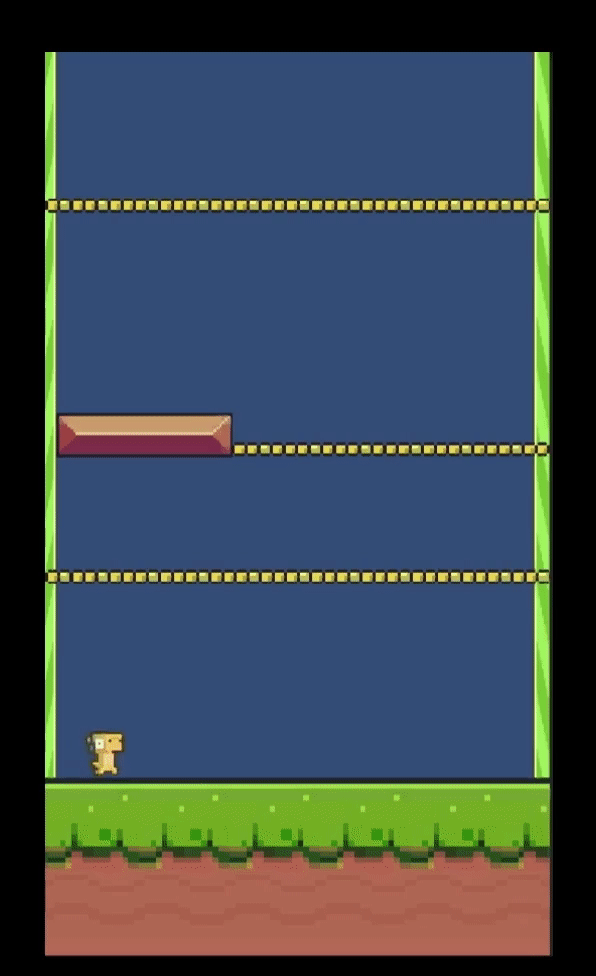
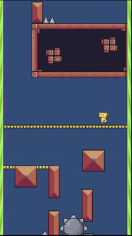

<h1 align="center">Demonstration</h1>
<h3 align="center">This is the updation part of the project.</h3>

    <h3>First prototype</h3>    
     
    
  
    	
    	
    

    <h3>Updated enemy/traps/new levels</h3>    
     
    
  
    	
    

    <h3>Updated game ui + theme/sfx sound + scrolling background</h3>
     
    

        
    

